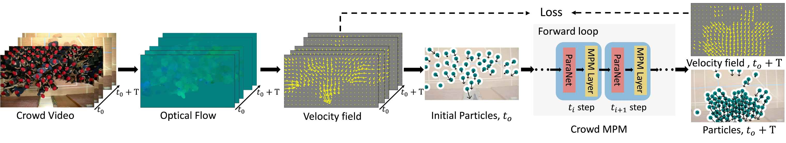

## [High-density-Crowds (CVPR 2025)](https://arxiv.org/pdf/2203.14412.pdf)

Video-based high-density crowd analysis and prediction has been a long-standing topic in computer vision. It is notoriously difficult due to, but not limited to, the lack of high-quality data and complex crowd dynamics. Consequently, it has been relatively under studied. In this paper, we propose a new approach that aims to learn from in-the-wild videos, often with low quality where it is difficult to track individuals or count heads. The key novelty is a new physics prior to model crowd dynamics. We model high-density crowds as active matter, a continumm with active particles subject to stochastic forces, named `crowd material'. Our physics model is combined with neural networks, resulting in a neural stochastic differential equation system which can mimic the complex crowd dynamics. Due to the lack of similar research, we adapt a range of existing methods which are close to ours for comparison. Through exhaustive evaluation, we show our model outperforms existing methods in analyzing and forecasting extremely high-density crowds. Furthermore, since our model is a continuous-time physics model, it can be used for simulation and analysis, providing strong interpretability. This is categorically different from most deep learning methods, which are discrete-time models and black-boxes.

## Getting Started
### Dependencies
Below is the key environment under which the code was developed, not necessarily the minimal requirements:

1. Python 3.8.18
2. pytorch 1.8.2

And other libraries such as numpy.

### Authors
Feixiang He, Jiangbei Yue, Jialin Zhu, Armin Seyfried, Dan Casas, Julien Pettré, He Wang

Feixiang He, fxhe1992@gmail.com

He Wang, he_wang@ucl.ac.uk, [Personal website](https://drhewang.com)

Project Webpage: http://drhewang.com/pages/iplan.html

### Contact
If you have any questions, please contact me: Feixiang He(fxhe1992@gmail.com)

### Citation (Bibtex)
Please cite our paper if you find it useful:

### License

Copyright (c) 2025, University College London, UK. All rights reserved.

Redistribution and use in source and binary forms, with or without modification, are permitted provided that the following conditions are met:

* Redistributions of source code must retain the above copyright notice, this list of conditions and the following disclaimer.

* Redistributions in binary form must reproduce the above copyright notice, this list of conditions and the following disclaimer in the documentation and/or other materials provided with the distribution.

THIS SOFTWARE IS PROVIDED BY THE COPYRIGHT HOLDERS AND CONTRIBUTORS "AS IS" AND ANY EXPRESS OR IMPLIED WARRANTIES, INCLUDING, BUT NOT LIMITED TO, THE IMPLIED WARRANTIES OF MERCHANTABILITY AND FITNESS FOR A PARTICULAR PURPOSE ARE DISCLAIMED. IN NO EVENT SHALL THE COPYRIGHT HOLDER OR CONTRIBUTORS BE LIABLE FOR ANY DIRECT, INDIRECT, INCIDENTAL, SPECIAL, EXEMPLARY, OR CONSEQUENTIAL DAMAGES (INCLUDING, BUT NOT LIMITED TO, PROCUREMENT OF SUBSTITUTE GOODS OR SERVICES; LOSS OF USE, DATA, OR PROFITS; OR BUSINESS INTERRUPTION) HOWEVER CAUSED AND ON ANY THEORY OF LIABILITY, WHETHER IN CONTRACT, STRICT LIABILITY, OR TORT (INCLUDING NEGLIGENCE OR OTHERWISE) ARISING IN ANY WAY OUT OF THE USE OF THIS SOFTWARE, EVEN IF ADVISED OF THE POSSIBILITY OF SUCH DAMAGE.
